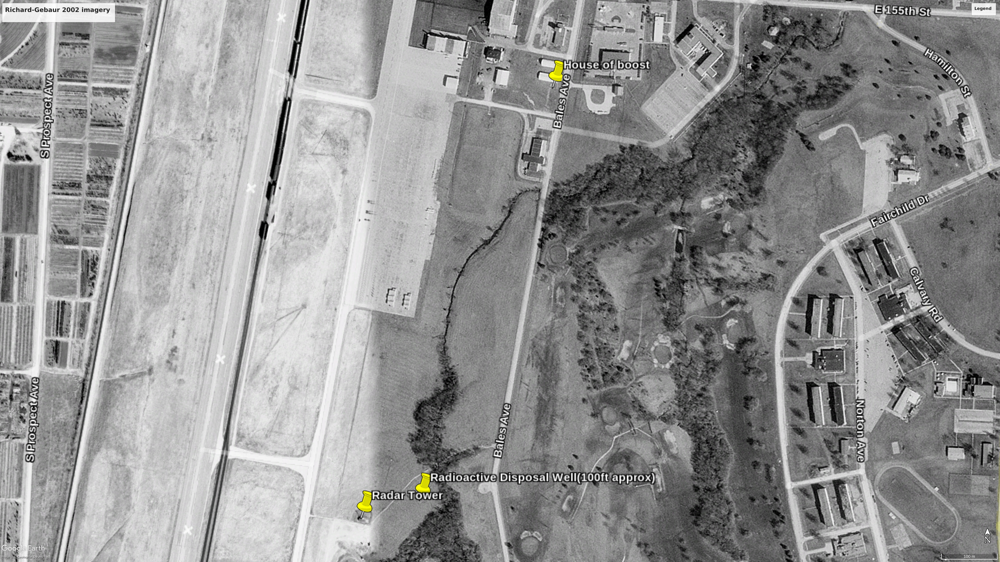
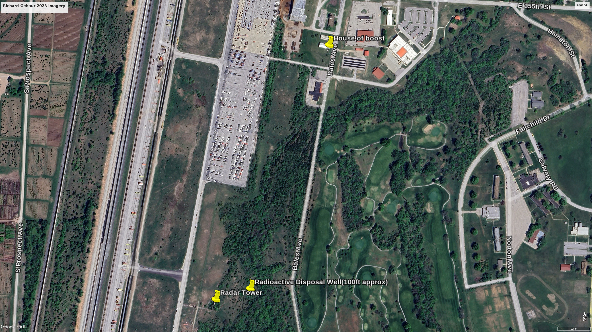

# Purpose
Someone posted an image of an old Richard-Gebaur AFB map
in a local KC history facebook group, which mentioned a radioactive
waste dump. These are some documents and images from googling.

# Folder Structure:

- README.txt: this file.
- documentation_sources: public records about the location.
- extracted_images: images cut and rendered from documentation_sources
- Richards-Gebaur.kmz: images and waypoints added to KMZ format
- compiled_maps: KMZ waypoints over a few different base maps
	
# Examples

